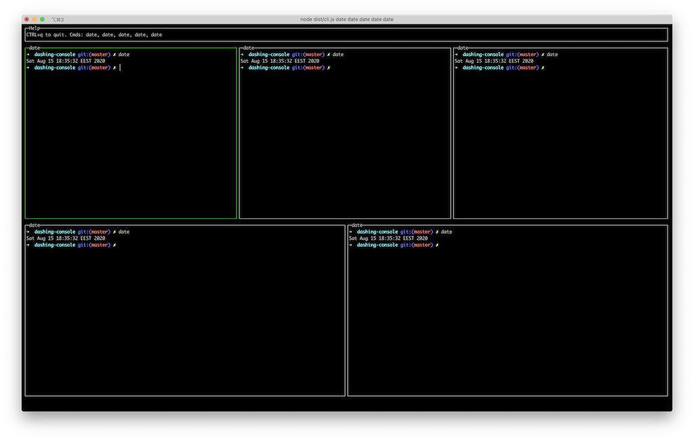

# dashing-console

Simple way to launch multiple commands in dashboard

## Install as a dependency

With `yarn`

    yarn add --dev dashing-console
    yarn dashing-console date "yarn build" "ls -l"

With `npm`

    npm install --dev dashing-console

    // Add entry in packge.json
    "scripts": {
        "dashboard": "dashing-console date 'yarn build' 'ls -l'"
    }

    npm run dashboard

## Using as global package

The dashing-console can be installed globally and
used to run any command
